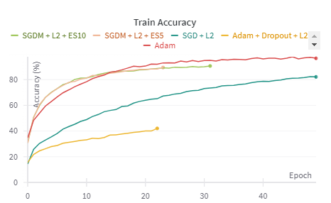
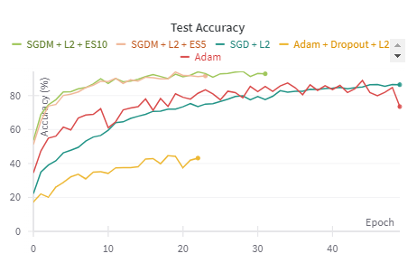
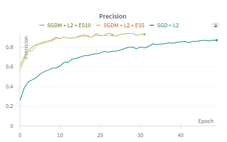
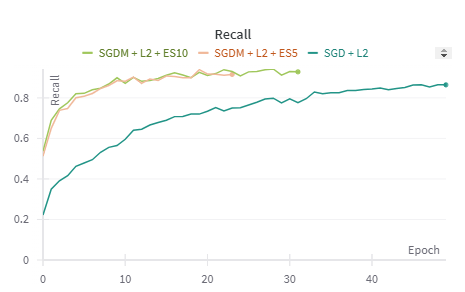
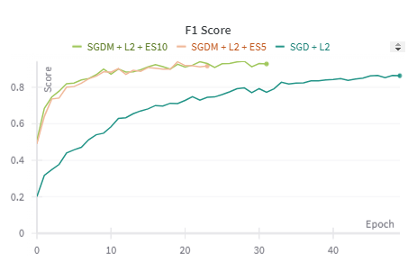

# Mushtroom Genus Classifier

## Overview
The project aimed to create a mushroom classifier, which identifies mushrooms from one of 12 classes based on the provided image. The dataset used is available [here].

Before building the model, data augmentation was performed. The model is based on the ResNet101 architecture. We conducted five experiments to compare different optimizers and regularization techniques. Each model was trained for 50 epochs, and evaluation was done using standard metrics: Accuracy, Precision, Recall, and F1-score.

### The experiments conducted:
- Adam
- Adam + Dropout + L2
- SGD + L2
- SGDM + L2 + Early Stopping (5)
- SGDM + L2 + Early Stopping (10)

We also used the Weights and Biases (wandb) library in the project. This tool helped in tracking and visualizing machine learning experiments. It was used to log the training progress, model performance metrics, and hyperparameters, facilitating experiment tracking and model comparison.
Thanks to live training progress tracking, we decided to interrupt one of the experiments because the regularization applied was too restrictive. 

## Results

  

  

  

  

  

